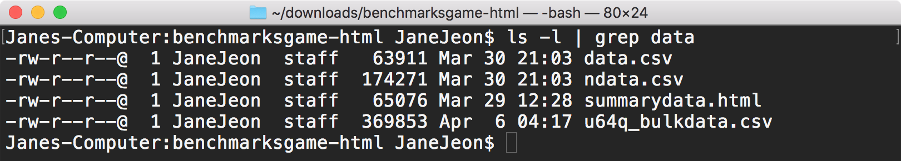
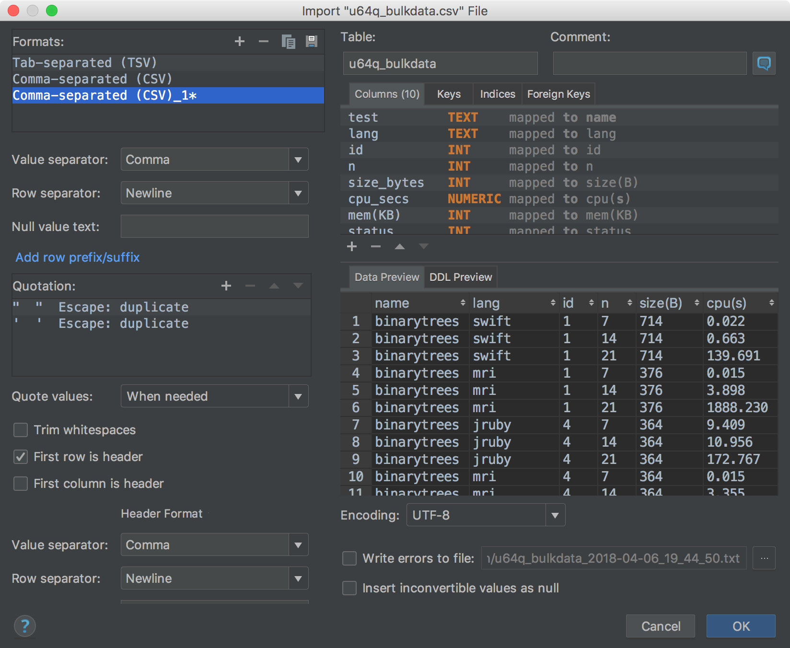
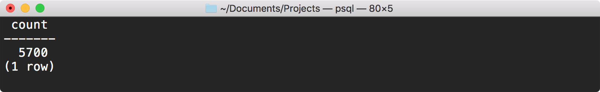
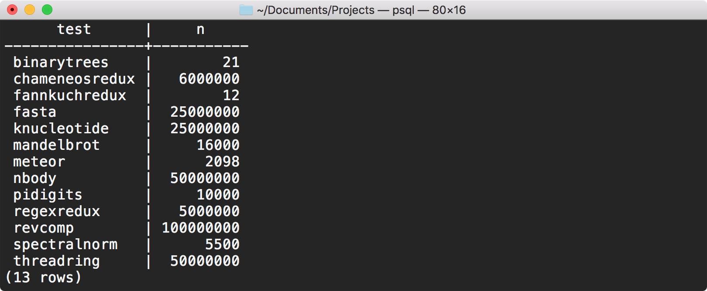
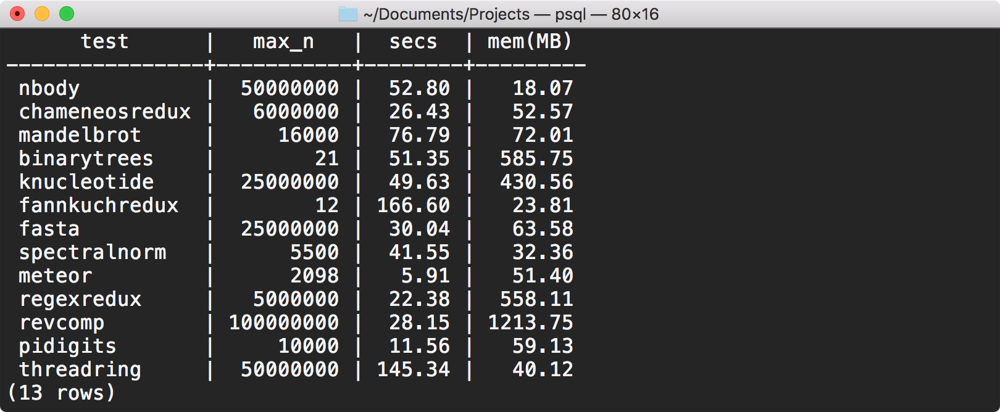
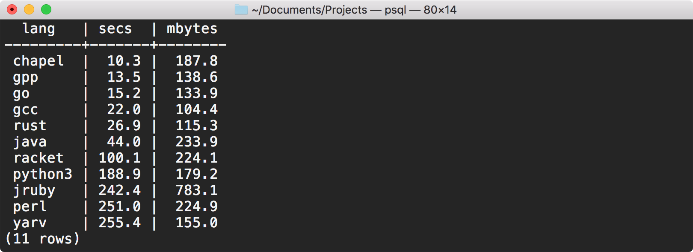

# Analyzing the The Computer Language Benchmarks Game

I have always been interested in programming languages, and in particular, how they perform (or not). And no matter what you Googled, what kind of discussions you would get into on the issue, you would often see references to [Computer Language Benchmarks Game](http://benchmarksgame.alioth.debian.org/). Although far from perfect (for example, it seems to just `time` the program running time, which meant that language runtimes that JIT compiled its code were inherently disadvantaged due to the warm-up time), it served as a de-facto starting point for discussions.

I have previously made efforts to try to analyze the data up on the site, including [this attempt](https://github.com/JaneJeon/Benchmark-Game-Summary) (which produces the report below) in which I literally just averaged the scores on each *lang1 vs. lang2* page, and as crude as it was (I *am* a college student strapped on time, after all), it gave me a *general* idea of the performance landscape, and I thought it was good enough *for now* and that maybe I'll get to properly exploring it later.


Well, that time came last week when [this bomb](https://www.reddit.com/r/programming/comments/88jg07/the_computer_language_benchmarks_games/) dropped: it was set to go dark on May 1st, due to the hosting provider dropping its service. And if you visited the site at the time, it showed the announcement, along with a link to download the entire site (I was planning on using `httrack` anyway).

And after downloading the site and sifting through its contents, I quickly noticed a couple of "data" files (literally):



Being the simpleton I am, I took a quick look at the file sizes and chose to go with the biggest one. Yeah. I know.
With the data, I had a couple of options: ingesting it through Excel (yuck), R (which I was still uncomfortable with), or just plain ol' SQL. I went with SQL because I wanted to practice writing complex SQL queries anyway.
So I ingested the data into a local PostgreSQL database, using the handy "Import Data From File" from DataGrip:


And it gives you all sorts of options. Pretty neat! It even maps the data types and automatically creates a table for you. I basically didn't touch anything other than to rename some fields to avoid having to quote them in SQL queries (yes, I'm lazy).



With the data in the database, I explored some basic facts about the benchmark runs, starting with some innocent ones:

```SQL
-- total benchmark runs
SELECT COUNT(*)
FROM benchmarks;
```



```SQL
-- the languages tested
SELECT DISTINCT lang
FROM benchmarks
ORDER BY lang;
```


```SQL
-- exit codes (they're all successes)
SELECT DISTINCT status
FROM benchmarks;
```


Looks like the data only contains successful runs.

Then I looked deeper into the tests that were run, and as I was interested in *peak* performance, I pruned out the shorter test runs.

```SQL
-- take the longest variations from each test
SELECT test, MAX(n) AS n
FROM benchmarks
GROUP BY 1
ORDER BY 1;
```



```SQL
-- average time, memory per max test
SELECT t1.test, t2.n                    AS max_n,
  ROUND(AVG(elapsed_secs)::NUMERIC, 2)  AS secs,
  ROUND(AVG(mem_kb)::NUMERIC / 1000, 2) AS "mem(MB)"
FROM benchmarks t1
JOIN (
  SELECT test, MAX(n) AS n
  FROM benchmarks
  GROUP BY 1
) t2
ON t1.test = t2.test AND t1.n = t2.n
GROUP BY 1, 2;
```



However, when I tried to actually rank the languages, I quickly ran into a problem - mainly, not all languages had successfully running implementations for each test! This really skewed the rankings in favour of languages that only had 'short' implementations (scala is faster than C, haha - good one).

```SQL
-- get average time, memory per language (skewed!)
SELECT lang,
  ROUND(AVG(elapsed_secs)::NUMERIC, 2)  AS secs,
  ROUND(AVG(mem_kb)::NUMERIC / 1000, 2) AS "mem(MB)"
FROM benchmarks
GROUP BY 1
ORDER BY 2;
```


So I tried to select languages that had successful implementations for *all* the tests... (the code is starting to look disgusting)

```SQL
-- select "fully-tested" languages only: ie. for each test & n, the lang is tested
SELECT DISTINCT lang
FROM benchmarks
WHERE lang NOT IN (
  SELECT DISTINCT l.lang
  FROM (
    SELECT t1.test, t1.n, t2.lang
    FROM (
      SELECT DISTINCT test, n
      FROM benchmarks
    ) AS t1
    CROSS JOIN (
      SELECT DISTINCT lang
      FROM benchmarks
    ) AS t2
  ) AS l
  LEFT JOIN (
    SELECT DISTINCT test, n, lang
    FROM benchmarks
  ) AS r
  ON l.test = r.test AND l.n = r.n AND l.lang = r.lang
  WHERE r.lang IS NULL
);
```


...and the ones that had running implementations just for the *hardest* of tests.

```SQL
-- select languages that are tested only in the hardest tests (the same!)
SELECT DISTINCT lang
FROM benchmarks
WHERE lang NOT IN (
  SELECT DISTINCT l.lang
  FROM (
    SELECT t1.test, t1.max, t2.lang
    FROM (
      SELECT test, MAX(n) AS max
      FROM benchmarks
      GROUP BY test
    ) AS t1
    CROSS JOIN (
      SELECT DISTINCT lang
      FROM benchmarks
    ) AS t2
  ) AS l
  LEFT JOIN (
    SELECT DISTINCT test, n, lang
    FROM benchmarks
  ) AS r
  ON l.test = r.test AND l.max = r.n AND l.lang = r.lang
  WHERE r.lang IS NULL
);
```


Huh. They're the same. This probably indicates that there wasn't a problem with any language's implementations failing on higher *n*.

By Frankensteining the code snippets from above, I tried to see how the performance was for languages that *did* have running implementations for all tests, for the hardest tests only:

```SQL
-- get the performance of fully-tested languages in the hardest tests
SELECT t1.test, t2.lang, t2.secs, t2.mbytes
FROM (
  -- select hardest tests
  SELECT test, MAX(n) AS n
  FROM benchmarks
  GROUP BY 1
) t1
JOIN (
  -- keep out outliers outside of 2 standard deviations
  WITH bounds AS (
    SELECT
      AVG(elapsed_secs) - 2 * STDDEV_SAMP(elapsed_secs) AS lower_secs,
      AVG(elapsed_secs) + 2 * STDDEV_SAMP(elapsed_secs) AS upper_secs,
      AVG(mem_kb) - 2 * STDDEV_SAMP(mem_kb) AS lower_mem,
      AVG(mem_kb) + 2 * STDDEV_SAMP(mem_kb) AS upper_mem
    FROM benchmarks
  )
  SELECT test, n, lang,
    AVG(elapsed_secs)::NUMERIC(10, 2)   AS secs,
    (AVG(mem_kb)/ 1000)::NUMERIC(10, 1) AS mbytes
  FROM benchmarks
  WHERE elapsed_secs
    BETWEEN (SELECT lower_secs FROM bounds)
    AND (SELECT upper_secs FROM bounds)
  AND mem_kb
    BETWEEN (SELECT lower_mem FROM bounds)
    AND (SELECT upper_mem FROM bounds)
  GROUP BY 1, 2, 3
) t2
ON t1.test = t2.test AND t1.n = t2.n
WHERE t2.lang IN (
  -- select languages that are tested only in the hardest tests
  SELECT DISTINCT lang
  FROM benchmarks
  WHERE lang NOT IN (
    SELECT DISTINCT l.lang
    FROM (
      SELECT t1.test, t1.max, t2.lang
      FROM (
        SELECT test, MAX(n) AS max
        FROM benchmarks
        GROUP BY test
      ) AS t1
      CROSS JOIN (
        SELECT DISTINCT lang
        FROM benchmarks
      ) AS t2
    ) AS l
    LEFT JOIN (
      SELECT DISTINCT test, n, lang
      FROM benchmarks
    ) AS r
    ON l.test = r.test AND l.max = r.n AND l.lang = r.lang
    WHERE r.lang IS NULL
  )
)
ORDER BY 1, 3;
```


Interesting results. You may have noticed that I had to take care of outliers in multiple test runs of the exact same benchmark, n, and language. 

Now let's try to summarize the whole ranking.

```SQL
-- summarize the performance of fully-tested languages in the hardest tests
SELECT t2.lang,
  -- using arithmetic mean
  AVG(t2.secs)::NUMERIC(5, 1)            AS secs,
  (AVG(t2.mbytes) / 1000)::NUMERIC(5, 1) AS mbytes
FROM (
  -- select hardest tests
  SELECT test, MAX(n) AS n
  FROM benchmarks
  GROUP BY 1
) t1
JOIN (
  -- keep out outliers of test runs outside of 2 standard deviations
  WITH bounds AS (
    SELECT
      AVG(elapsed_secs) - 2 * STDDEV_SAMP(elapsed_secs) AS lower_secs,
      AVG(elapsed_secs) + 2 * STDDEV_SAMP(elapsed_secs) AS upper_secs,
      AVG(mem_kb) - 2 * STDDEV_SAMP(mem_kb) AS lower_mem,
      AVG(mem_kb) + 2 * STDDEV_SAMP(mem_kb) AS upper_mem
    FROM benchmarks
  )
  SELECT test, n, lang,
    AVG(elapsed_secs) AS secs,
    AVG(mem_kb)       AS mbytes
  FROM benchmarks
  WHERE elapsed_secs
    BETWEEN (SELECT lower_secs FROM bounds)
    AND (SELECT upper_secs FROM bounds)
  AND mem_kb
    BETWEEN (SELECT lower_mem FROM bounds)
    AND (SELECT upper_mem FROM bounds)
  GROUP BY 1, 2, 3
) t2
ON t1.test = t2.test AND t1.n = t2.n
WHERE t2.lang IN (
  -- select languages that are tested only in the hardest tests
  SELECT DISTINCT lang
  FROM benchmarks
  WHERE lang NOT IN (
    -- select languages that *should* have rows
    -- according to the cross product of tests and languages
    -- but *doesn't* in the actual recorded test table
    SELECT DISTINCT l.lang
    FROM (
      SELECT t1.test, t1.max, t2.lang
      FROM (
        SELECT test, MAX(n) AS max
        FROM benchmarks
        GROUP BY test
      ) AS t1
      CROSS JOIN (
        SELECT DISTINCT lang
        FROM benchmarks
      ) AS t2
    ) AS l
    LEFT JOIN (
      SELECT DISTINCT test, n, lang
      FROM benchmarks
    ) AS r
    ON l.test = r.test AND l.max = r.n AND l.lang = r.lang
    WHERE r.lang IS NULL
  )
)
GROUP BY 1
ORDER BY 2, 3;
```



Whoa, we're getting some weird results (for one, golang most definitely *isn't* faster than C). Given what we know about the average test durations from above, it seems like some of the tests (especially the more taxing ones) are skewing our results due to us taking the arithmetic mean of the results per language. 

Let's try using geometric mean to summarize the results instead, using [some tricks](http://timothychenallen.blogspot.com/2006/03/sql-calculating-geometric-mean-geomean.html) to simplify the implementation:

```SQL
-- summarize the performance of fully-tested languages in the hardest tests
SELECT t2.lang,
  -- take the geometric mean to account for the more extreme tests
  EXP(AVG(LN(t2.secs)))::NUMERIC(5, 1)            AS secs,
  (EXP(AVG(LN(t2.mbytes))) / 1000)::NUMERIC(5, 1) AS mbytes
FROM (
  -- select hardest tests
  SELECT test, MAX(n) AS n
  FROM benchmarks
  GROUP BY 1
) t1
JOIN (
  -- keep out outliers of test runs outside of 2 standard deviations
  WITH bounds AS (
    SELECT
      AVG(elapsed_secs) - 2 * STDDEV_SAMP(elapsed_secs) AS lower_secs,
      AVG(elapsed_secs) + 2 * STDDEV_SAMP(elapsed_secs) AS upper_secs,
      AVG(mem_kb) - 2 * STDDEV_SAMP(mem_kb) AS lower_mem,
      AVG(mem_kb) + 2 * STDDEV_SAMP(mem_kb) AS upper_mem
    FROM benchmarks
  )
  SELECT test, n, lang,
    AVG(elapsed_secs)          AS secs,
    GREATEST(AVG(mem_kb), 0.5) AS mbytes
  FROM benchmarks
  WHERE elapsed_secs
    BETWEEN (SELECT lower_secs FROM bounds)
    AND (SELECT upper_secs FROM bounds)
  AND mem_kb
    BETWEEN (SELECT lower_mem FROM bounds)
    AND (SELECT upper_mem FROM bounds)
  GROUP BY 1, 2, 3
) t2
ON t1.test = t2.test AND t1.n = t2.n
WHERE t2.lang IN (
  -- select languages that are tested only in the hardest tests
  SELECT DISTINCT lang
  FROM benchmarks
  WHERE lang NOT IN (
    -- select languages that *should* have rows
    -- according to the cross product of tests and languages
    -- but *doesn't* in the actual recorded test table
    SELECT DISTINCT l.lang
    FROM (
      SELECT t1.test, t1.max, t2.lang
      FROM (
        SELECT test, MAX(n) AS max
        FROM benchmarks
        GROUP BY test
      ) AS t1
      CROSS JOIN (
        SELECT DISTINCT lang
        FROM benchmarks
      ) AS t2
    ) AS l
    LEFT JOIN (
      SELECT DISTINCT test, n, lang
      FROM benchmarks
    ) AS r
    ON l.test = r.test AND l.max = r.n AND l.lang = r.lang
    WHERE r.lang IS NULL
  )
)
GROUP BY 1
ORDER BY 2, 3;
```


Now that's more like it! Since I'm using geometric mean (and that involves taking the log of individual values), the cases in which the memory consumed was reportedly 0kB (ie. rounded down to 0) threw errors in my face. To account for that, I set the memory consumption to simply 0.5kB in those cases.

To me, several details popped out about this data. For one, what the heck is Chapel and why is it on the top of the list? [A quick Googling](https://en.wikipedia.org/wiki/Chapel_(programming_language)) tells us that it's some fancy language made by Cray (*that* company who makes supercomputers), and given that the tests were run on a quad-core machine, I guess its implementations of the tests took good advantage of the parallelism.

The same goes for Rust, beating out even grandaddy C (but consuming much more memory) and coming in the number 2 spot. C ran at basically the same speed as C++ while using less memory, as expected. The next surprise is golang coming in so close to C++ in performance, and even beating it out in memory consumption! My understanding was that it basically traded blows with Java, but I guess that information is wrong! Java is basically where I'd expected it to be - about 2x slower than C/C++, while consuming a lot more memory (after all, it has a full VM to manage, with the overhead of countless objects in the heap).

And the rest are just scripting languages (interpreted), as expected. It's hard for the compiler/interpreter to optimize the running code when it doesn't know much. I'm not used to Racket, but it seems to be handily beating down everyone else in speed. I'm not sure what causes its comparatively high memory consumption, however.

JRuby consuming *crazy* amounts of memory while not even being faster than yarv is... unfortunately expected, given the nature of these benchmarks, the JVM having an overhead, and JRuby abusing *invokedynamic*. However, [the JVM can be *blazing* fast - and I mean 9x faster peak speed than the reference implementation](https://github.com/mame/optcarrot/blob/master/doc/benchmark.md), as shown by the TruffleRuby implementation (based on the new JIT compiler - Graal - written in Java).

I thought python and ruby (yarv) would blow trades, but I was wrong, once again - python is clearly the faster and the more memory-efficient of the two. However, with Ruby 3x3 showing promising progress in the JIT department, I'll be looking forward to Ruby making strides beyond the current python performance line, at the very least.

Finally, surprising *literally nobody*, perl is dead last. Honestly, did anyone think it would end up anywhere else other than *dead last* when they first saw perl on the list halfway through the article?

And that's where I am with analyzing the Benchmark Game data! I still have a few ways to go - namely, taking into account of the languages that *didn't* have implementations for all of the tests - and it'll be an even more daunting task, I'm sure. However, as I'm just a college student with tight deadlines (in fact, I've got a paper due tomorrow morning), I will leave it here for now. I'll perhaps pick this back up when I have time again.

---

Funny afterword: although I got started with analyzing this data because of the threat of the website going down, as of time of writing this article, it seems someone else has started [hosting the site again](https://benchmarksgame-team.pages.debian.net/benchmarksgame). Well, I don't think this effort was a waste. After all, if anything, it was a good learning experience.
